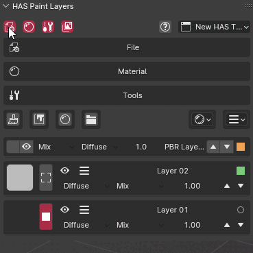
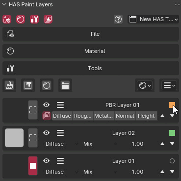

# Customization

## Tabs
Buttons located in the top-left corner of the panel allow you to enable or disable specific panels that you may not use.

## Layer Customization

Each layer has a button in the top-right corner that can be used to make the layer more compact, saving space in the interface. Additionally, each layer can be color-tagged to help with organization. There are **eight different colors** available, which can help you visually categorize layers by type or function.

To change a layer's color tag, go to the **Layer Action** menu and select the **Color Option**. This color-coding feature is especially useful for larger projects that involve multiple layers, as it helps quickly identify specific types of layers at a glance.

## Keymap
**HAS Paint** comes with a few built-in shortcuts to enhance productivity:

- **Change Brush to Eraser and Reverse**: Press **E** to toggle between brush and eraser modes.

- **Draw with Line**: Hold **W** to draw straight lines.

To customize these shortcuts, go to the **Addon Preferences** and open the **Shortcuts Panel**.

---
